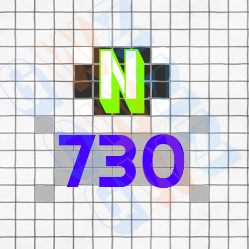
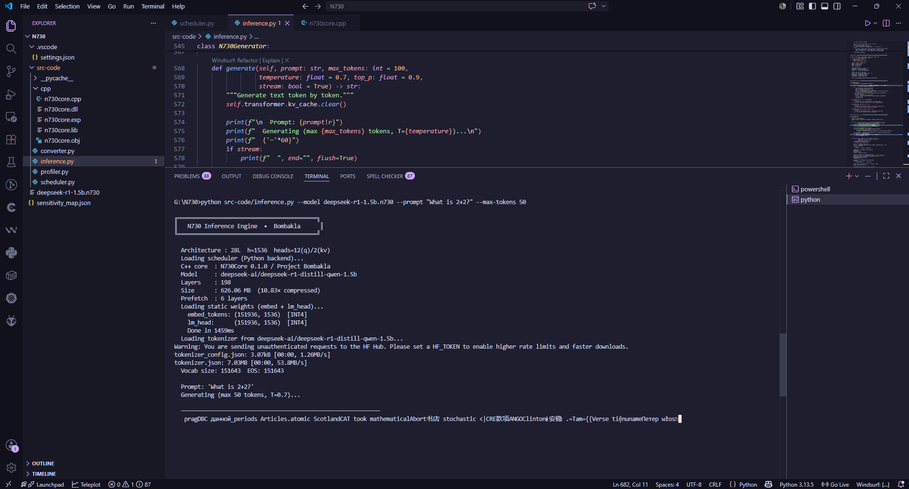
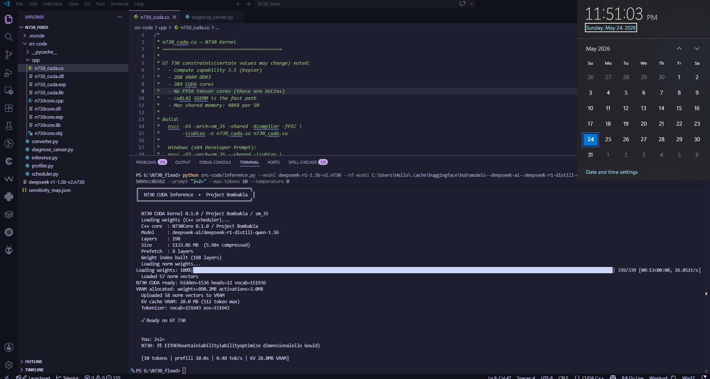

<p align="center">
  
</p>

<h1 align="center">N730</h1>

<p align="center">
  Experimental streamed transformer inference for legacy GPUs.
</p>

<p align="center">
  
  
  
  
</p>

---

# What is N730?

N730 is an experimental AI inference runtime built to run modern
Large Language Models on extremely low-end hardware such as the
NVIDIA GT 730.

Instead of loading an entire model into VRAM at once, N730 streams
quantized transformer layers dynamically during inference, allowing
models far larger than GPU memory capacity to run on legacy hardware.

---

## Features

- Layer streaming runtime
- Dynamic mixed precision quantization
- Native AVX2/C++ backend
- CUDA acceleration for Kepler GPUs
- Runtime dequantization
- KV cache autoregressive inference
- HuggingFace conversion pipeline

---

## Quick Setup

```powershell

  #Compile the core (Win CPP)
  #Recommended and tested setup: VS2019, MSVC v142 and C++ Desktop Workload(full)
  #CUDA 11.4 to 9.0 ONLY
  #Open x64 Native Tools Command Prompt for VS2019
  #Run (inside directory src-code/cpp):

  cl /O2 /arch:AVX2 /LD n730core.cpp /Fe:n730core.dll

  #Compile the CUDA kernel

  "cuda_installation_folder\bin\nvcc.exe" -O3 -arch=sm_35 --shared -lcublas -o n730_cuda.dll n730_cuda.cu

  #Run the profiler with a model (example: deepseek-r1-1.5b-v2)

  python src-code/profiler.py --model <hf-model-id-or-local-cache> --output sensitivity_map.json

  #On Windows, model cache(for Deepseek) usually exists in: C:\Users\<your-username>\.cache\huggingface\hub\models--deepseek-ai--deepseek-r1-distill-qwen-1.5b\snapshots\<some-kind-of-hash>

  #Now run the converter to get the sensitivity INT8 map to the custom optimized .n730 format(again, given example is for Deepseek)

  python converter.py --model deepseek-ai/deepseek-r1-distill-qwen-1.5b --sensitivity sensitivity_map.json --output deepseek-r1-1.5b.n730

  #FINAL STEP: fucking inference, AI go brrrrrrrrr

  # First run (downloads tokenizer once):
  python inference.py --model deepseek-r1-1.5b.n730 --prompt "What is 2+2?" --max-tokens 50

  # With local tokenizer cache (faster, no internet):
  python inference.py --model deepseek-r1-1.5b.n730 --tokenizer C:\path\to\cached\model --prompt "Hello"

  # Interactive chat:
  python inference.py --model deepseek-r1-1.5b.n730 --interactive
```

## Usage(component-wise)

```powershell
#profiler(synthetic test run as well)

    python profiler.py --model <path_or_hf_id> --output sensitivity_map.json
    python profiler.py --synthetic --layers 32 --output sensitivity_map.json

#converter

    python converter.py --model deepseek-ai/deepseek-r1-distill-qwen-1.5b \\
                        --sensitivity sensitivity_map.json \\
                        --output model.n730

    python converter.py --synthetic --sensitivity sensitivity_map.json \\
                        --output model.n730

#scheduler

    python scheduler.py --model deepseek-r1-1.5b.n730 --benchmark
    python scheduler.py --model deepseek-r1-1.5b.n730 --layer 42
    python scheduler.py --model deepseek-r1-1.5b.n730 --benchmark --simulate-gpu-ms 50
```
---

## Status

 <p align="left">
  
</p>

 <p align="right">
  
</p>

---

## Capabilities

- Converting HuggingFace transformer models into the `.n730` format
- Streaming 198+ transformer layers from disk in real time
- Running autoregressive transformer inference
- Dynamically dequantizing INT2 / INT4 / INT8 / FP16 weights
- Executing inference on hardware as old as the GT 730
---

## Concept

Instead of loading an entire model into VRAM at once, N730 streams quantized transformer layers dynamically during inference, allowing models far larger than the GPU's memory capacity to run on legacy hardware.

---

## Supported Quantization

| Format | Status |
|---|---|
| FP16 | Working |
| INT8 | Working |
| INT4 | Experimental |
| INT2 | Experimental / cursed |

---

## Hardware Tested

| GPU | Status |
|---|---|
| GT 730 2GB DDR3 | Working |
| GTX 1650 | Untested |
| RTX Series | Needs re-done compiler with different instruction set |

---

## License

MIT

## Disclaimer

N730 is an experimental research project haha.

Performance, correctness, and stability are not working send help pls

This project is not affiliated with NVIDIA, DeepSeek, HuggingFace, or any model provider. F*ck big model providers.
